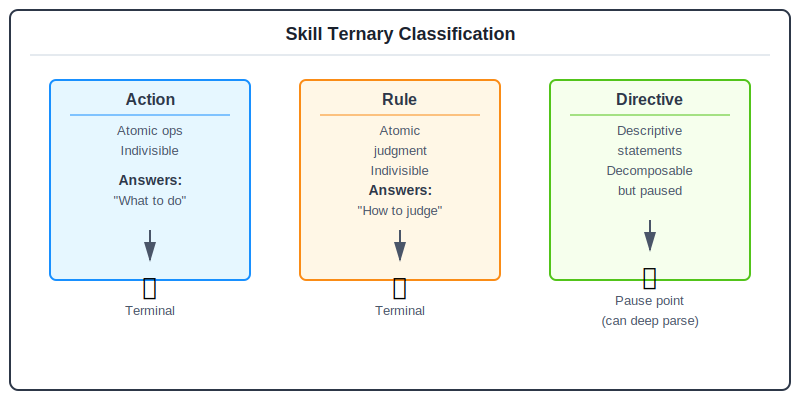

# Skill-0: Skill Decomposition Parser

> A ternary classification system for parsing the internal structure of Claude Skills and MCP Tools

[](https://www.python.org/downloads/)
[](https://opensource.org/licenses/MIT)
[](schema/skill-decomposition.schema.json)

## Overview

Skill-0 is a classification system that parses AI/Chatbot Skills (especially Claude Skills and MCP Tools) into structured components. It includes **semantic search** powered by vector embeddings for intelligent skill discovery.

## Compatibility with Existing Skills

### Low-risk adoption path

1. **Keep existing skills intact**: do sidecar parsing first (`SKILL.md`/tool definitions → Skill-0 JSON).
2. **Build a mapping layer**: map original text blocks to `actions/rules/directives` for shared vocabulary.
3. **Roll out incrementally**: start with search/governance/review workflows before enforcing authoring changes.

### Practical applications

- **Skill inventory and deduplication** with semantic search.
- **Governance review** with structured checks on rules, constraints, and failure patterns.
- **Operational handover** by turning tacit knowledge into queryable elements.

### Pros and trade-offs

| Area | Pros | Trade-offs |
|------|------|------------|
| Compatibility | Sidecar rollout avoids full rewrite | Two artifacts to maintain in early stages |
| Dev productivity | Structured data improves search, comparison, templating | Initial decomposition and tagging cost |
| Governance quality | Rules/directives become reviewable and standardizable | Analysis quality depends on decomposition accuracy |
| Scalability | Integrates with API, dashboard, vector search | Schema upgrades require migration planning |

## Ternary Classification System

Organizes and defines the immutable parts of a Skill (or parts that change behavior when modified) into three categories:



| Category | Definition | Characteristics |
|----------|------------|-----------------|
| **Action** | Atomic operation: indivisible basic operation | Deterministic result, no conditional branching, atomic |
| **Rule** | Atomic judgment: pure conditional evaluation/classification | Returns boolean/classification result |
| **Directive** | Descriptive statement: decomposable but chosen not to at this level | Contains completion state, knowledge, principles, constraints, etc. |

### Directive Types

| Type | Description | Example |
|------|-------------|---------|
| `completion` | Completion state description | "All tables extracted" |
| `knowledge` | Domain knowledge | "PDF format specification" |
| `principle` | Guiding principle | "Optimize Context Window" |
| `constraint` | Constraint condition | "Max 25,000 tokens" |
| `preference` | Preference setting | "User prefers JSON format" |
| `strategy` | Strategy guideline | "Retry three times on error" |

### Directive Provenance (Optional)

Skills/Tools may come from diverse sources where the original intent cannot be fully verified. To preserve the original spirit, a `Directive` can optionally include `provenance` in two tiers:

- `basic`: minimal traceability + verbatim excerpt
- `full`: adds location + extraction/translation metadata (backend can encode based on this)

**Basic**

```json
"provenance": {
  "level": "basic",
  "source": { "kind": "mcp_tool", "ref": "example-tool" },
  "original_text": "Prefer concise output"
}
```

**Full**

```json
"provenance": {
  "level": "full",
  "source": { "kind": "claude_skill", "ref": "converted-skills/docx/SKILL.md", "version": "v1" },
  "original_text": "Keep changes minimal",
  "location": { "locator": "SKILL.md#L120" },
  "extraction": { "method": "llm", "inferred": true, "confidence": 0.7 }
}
```

### ID Format

| Element | Pattern | Example |
|---------|---------|---------|
| Action | `a_XXX` | `a_001`, `a_002` |
| Rule | `r_XXX` | `r_001`, `r_002` |
| Directive | `d_XXX` | `d_001`, `d_002` |

## Project Structure

```
skill-0/
├── api/                               # REST API (FastAPI, port 8000)
│   ├── main.py                       # Main API with JWT auth & rate limiting
│   └── logging_config.py            # Structured logging (structlog)
├── vector_db/                         # Vector database module
│   ├── embedder.py                   # Embedding generator (all-MiniLM-L6-v2)
│   ├── vector_store.py               # SQLite-vec storage
│   └── search.py                     # Semantic search engine
├── skill-0-dashboard/                 # Governance Dashboard
│   └── apps/
│       ├── api/                      # Dashboard API (FastAPI, port 8001)
│       └── web/                      # React 19 + Vite frontend
├── governance/                        # Governance system
│   └── db/governance.db              # Skill approval workflow DB
├── schema/                            # JSON Schema v2.4
├── parsed/                            # Parsed skill examples (195 checked-in JSON files)
├── tools/                             # Analysis & governance tools
├── scripts/                           # Maintenance scripts
├── tests/                             # Test suites and fixtures
├── docker-compose.yml                 # Development Docker setup
├── docker-compose.prod.yml            # Production Docker setup
├── Dockerfile.{api,dashboard,web}     # Container images
└── skills.db                          # Vector database
```

## Installation

```bash
# Clone the repository
git clone https://github.com/pingqLIN/skill-0.git
cd skill-0

# Initialize environment variables for local development
cp .env.example .env

# Create a repo-local virtual environment
python3 -m venv .venv
source .venv/bin/activate

# Install Python dependencies for core API + dashboard API + tests
.venv/bin/python -m pip install --upgrade pip
.venv/bin/python -m pip install -r requirements-dev.txt

# Match the frontend runtime used in CI and supported by Vite 7
nvm use || nvm install 20.19.0

# Install dashboard web dependencies
cd skill-0-dashboard/apps/web && npm ci
cd ../../..

# Index skills (first time)
.venv/bin/python -m vector_db.search --db skills.db --parsed-dir parsed index
```

Default local login credentials after copying `.env.example`:

- Core API / dashboard login username: `admin`
- Core API / dashboard login password: `change-me`

These values are for local development only. Production must replace them and the JWT secret before startup.

## Testing

The project includes a comprehensive test suite with 157 automated tests:

```bash
# Run the full Python regression suite (core API + dashboard API)
.venv/bin/python -m pytest tests skill-0-dashboard/apps/api/tests -q

# Run only core API tests
.venv/bin/python -m pytest tests/ -v

# Run only Dashboard API tests
.venv/bin/python -m pytest skill-0-dashboard/apps/api/tests/ -v

# Run frontend tests (Node 20.19+)
nvm use
cd skill-0-dashboard/apps/web && npm test

# Build frontend production bundle
nvm use
cd skill-0-dashboard/apps/web && npm run build

# Build frontend and enforce the bundle-size guardrail used in CI
nvm use
cd skill-0-dashboard/apps/web && npm run build:ci
```

**Test Coverage**:
- ✅ API security & rate limiting (tests/test_api_security.py)
- ✅ JWT authentication flow (tests/integration/test_auth_flow.py)
- ✅ Rate limiting behavior (tests/integration/test_rate_limiting.py)
- ✅ Dashboard API — all 5 routers (skill-0-dashboard/apps/api/tests/)
- ✅ Frontend smoke tests — 18 component tests (Vitest)
- ✅ Schema validation & format conversion
- ✅ Integration workflows

## REST API

Skill-0 provides two FastAPI servers:

### Main API (port 8000)

| Endpoint | Method | Auth | Description |
|----------|--------|------|-------------|
| `/api/search` | POST/GET | No | Semantic skill search |
| `/api/similar/{name}` | GET | No | Find similar skills |
| `/api/cluster` | GET | No | K-Means clustering |
| `/api/stats` | GET | No | Database statistics |
| `/api/skills` | GET | No | List all skills (paginated) |
| `/api/index` | POST | JWT | Re-index skills |
| `/api/auth/token` | POST | No | Get JWT token |
| `/health` | GET | No | Health check |
| `/metrics` | GET | No | Prometheus metrics |

### Governance Dashboard API (port 8001)

| Endpoint | Method | Auth | Description |
|----------|--------|------|-------------|
| `/api/stats` | GET | JWT | Dashboard statistics |
| `/api/skills` | GET | JWT | Skills with governance status |
| `/api/reviews` | GET | JWT | Pending review queue |
| `/api/scans` | GET | JWT | Security scan results |
| `/api/audit` | GET | JWT | Audit event log |

```bash
# Start both servers
uvicorn api.main:app --port 8000
cd skill-0-dashboard/apps/api && ../../.venv/bin/python -m uvicorn main:app --port 8001

# Development Docker compose
docker compose up

# Production Docker compose
cp .env.production.example .env
docker compose -f docker-compose.prod.yml up -d --build

# Production entrypoints after startup
# Web: http://127.0.0.1:3080
# Core API health: http://127.0.0.1:8080/health
```

## Semantic Search

Skill-0 includes a powerful semantic search engine powered by `all-MiniLM-L6-v2` embeddings and `SQLite-vec`.

### CLI Commands

```bash
# Index all skills
.venv/bin/python -m vector_db.search --db skills.db --parsed-dir parsed index

# Search by natural language
.venv/bin/python -m vector_db.search --db skills.db search "PDF document processing"

# Find similar skills
.venv/bin/python -m vector_db.search --db skills.db similar "Docx Skill"

# Cluster analysis (auto-grouping)
.venv/bin/python -m vector_db.search --db skills.db cluster -n 5

# Show statistics
.venv/bin/python -m vector_db.search --db skills.db stats
```

### Search Examples

```bash
$ .venv/bin/python -m vector_db.search search "creative design visual art"

🔍 Searching for: creative design visual art
--------------------------------------------------
1. Canvas-Design Skill (53.36%)
2. Theme Factory (46.14%)
3. Anthropic Brand Styling (45.54%)
4. Slack GIF Creator (45.44%)
5. Pptx Skill (45.08%)

Search completed in 72.6ms
```

### Python API

```python
from vector_db import SemanticSearch

# Initialize search engine
search = SemanticSearch(db_path='skills.db')

# Semantic search
results = search.search("PDF processing", limit=5)
for r in results:
    print(f"{r['name']}: {r['similarity']:.2%}")

# Find similar skills
similar = search.find_similar("Docx Skill", limit=5)

# Cluster analysis
clusters = search.cluster_skills(n_clusters=5)
```

## Quick Example

```json
{
  "decomposition": {
    "actions": [
      {
        "id": "a_001",
        "name": "Read PDF",
        "action_type": "io_read",
        "deterministic": true
      }
    ],
    "rules": [
      {
        "id": "r_001",
        "name": "Check File Exists",
        "condition_type": "existence_check",
        "returns": "boolean"
      }
    ],
    "directives": [
      {
        "id": "d_001",
        "name": "PDF Processing Complete",
        "directive_type": "completion",
        "description": "All tables extracted and saved to Excel",
        "decomposable": true
      }
    ]
  }
}
```

## Dataset Snapshot

| Metric | Count |
|--------|-------|
| **Skills** | 195 |
| **Actions** | 2220 |
| **Rules** | 1206 |
| **Directives** | 1642 |
| **Action Type Coverage** | 100% |
| **Directive Type Coverage** | 100% |

## Performance

Current indexing and search performance depends on hardware, model cache state, and whether the embedding model has already been downloaded. Re-run `.venv/bin/python -m vector_db.search --db skills.db --parsed-dir parsed index` locally for a current benchmark on your machine.

Stable characteristics:

| Metric | Value |
|--------|-------|
| Embedding Dimension | 384 |
| Database | SQLite-vec |

## Documentation

Comprehensive documentation is available:

- **[CLAUDE.md](CLAUDE.md)** - Best practices for Claude AI integration and skill decomposition
- **[SKILL.md](SKILL.md)** - Complete tool portal and workflow guide
- **[reference.md](reference.md)** - Schema reference and format specifications
- **[examples.md](examples.md)** - 7 detailed skill examples across different domains
- **[AGENTS.md](AGENTS.md)** - Guidelines for AI agents working on this project
- **[scripts/helper.py](scripts/helper.py)** - Helper utilities for validation, conversion, and testing
- **[docs/skill-0-vs-claude-code-simplifier.md](docs/skill-0-vs-claude-code-simplifier.md)** - Comparison with Claude Code Simplifier (EN)
- **[docs/skill-0-vs-claude-code-simplifier.zh-TW.md](docs/skill-0-vs-claude-code-simplifier.zh-TW.md)** - 與 Claude Code Simplifier 比較 (zh-TW)
- **[docs/shared-documentation-model.md](docs/shared-documentation-model.md)** - How shared contract docs are sourced from `skill-0` and mirrored into `skill-0-GUI`

### Quick Start Guide

```bash
# Generate a new skill template
python scripts/helper.py template -o my-skill.json

# Convert markdown to skill JSON
python scripts/helper.py convert skill.md my-skill.json

# Validate skill against schema
python scripts/helper.py validate my-skill.json

# Test execution paths
python scripts/helper.py test my-skill.json --analyze
```

See [docs/helper-test-results.md](docs/helper-test-results.md) for detailed test results and examples.

## Version

- Schema Version: 2.4.0
- Created: 2026-01-23
- Updated: 2026-02-26
- Author: pingqLIN

## Changelog

### v2.4.0 (2026-02-26) - Security, Testing & Production Readiness
- **Security**: JWT authentication for both API servers
- **Security**: Rate limiting with per-endpoint controls
- **Security**: CORS environment variable configuration
- **Security**: Production security enforcement (fail-fast on misconfiguration)
- **Monitoring**: Prometheus metrics endpoint (`/metrics`)
- **Monitoring**: Structured logging with structlog (JSON/console output)
- **Testing**: 79 new tests (111+ total) — Dashboard API, auth flow, rate limiting, frontend
- **DevOps**: Docker containerization (3 Dockerfiles + docker-compose)
- **DevOps**: CI/CD pipeline with pytest-cov, web build, Docker build verification
- **Tools**: Vector DB sync script with governance cross-reference
- **Schema**: v2.4.0 with Hive-inspired features (quality signals, success criteria, failure patterns)

### v2.3.0 (2026-01-28) - Testing & Quality Assurance
- **New Feature**: Comprehensive automated test suite
  - 32 tests covering all helper utilities
  - Validator consistency verification
  - Converter determinism verification
  - Integration workflow testing
  - Error handling and edge case coverage
- Test fixtures and documentation in `tests/`
- pytest configuration in `pyproject.toml`
- CI/CD ready test infrastructure

### v2.2.0 (2026-01-28) - Documentation & Tooling
- **New Feature**: Comprehensive documentation suite
  - `CLAUDE.md` - Claude best practices guide
  - `SKILL.md` - Complete tool portal and workflow
  - `reference.md` - Full schema reference
  - `examples.md` - 7 detailed skill examples
  - `AGENTS.md` - AI agent guidelines
- **New Tool**: `scripts/helper.py` - Utility for validation, conversion, and testing
  - Template generation
  - Markdown to JSON conversion
  - Schema validation
  - Execution path testing
  - Complexity analysis
- Integration with agents.md format standard
- Test results documentation in `docs/helper-test-results.md`

### v2.1.0 (2026-01-26) - Stage 2
- **New Feature**: Semantic search with vector embeddings
  - `vector_db` module with SQLite-vec integration
  - `all-MiniLM-L6-v2` embedding model (384 dimensions)
  - K-Means clustering for skill grouping
  - CLI tool: `.venv/bin/python -m vector_db.search`
- Expanded to 32 skills (+21 from awesome-claude-skills)
- Performance: 0.88s indexing, ~75ms search

### v2.0.0 (2026-01-26)
- **Breaking Change**: Redefined ternary classification
  - `core_action` → `action` (ID: `ca_XXX` → `a_XXX`)
  - `mission` → `directive` (ID: `m_XXX` → `d_XXX`)
- Added `directive_type` support: completion, knowledge, principle, constraint, preference, strategy
- Added `decomposable` and `decomposition_hint` fields
- Added `action_type`: `await_input`
- Schema structure optimization
- Added 19 new skills from ComposioHQ/awesome-claude-skills

### v1.1.0 (2026-01-23)
- Initial version

## License

MIT
