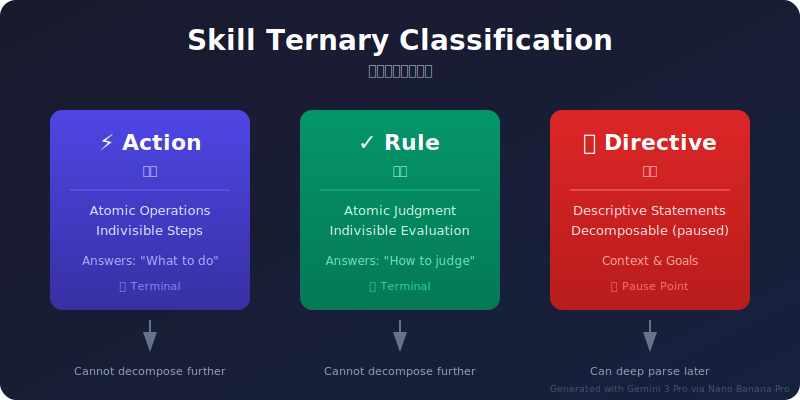
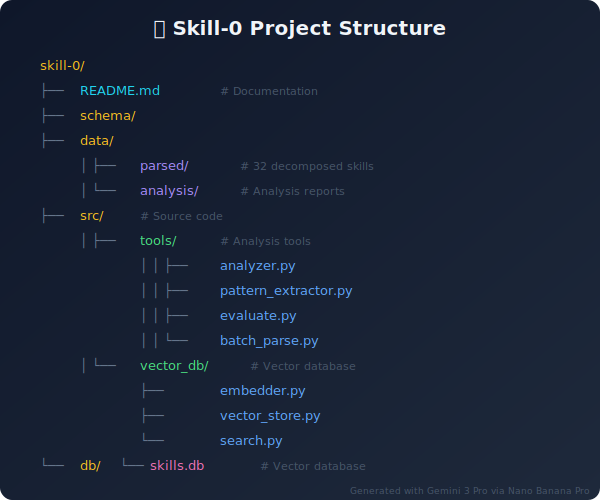

# Skill-0: 技能分解解析器

[English](README.md)

> 用於解析 Claude Skills 和 MCP Tools 內部結構的三元分類系統

[](https://www.python.org/downloads/)
[](https://opensource.org/licenses/MIT)
[](schema/skill-decomposition.schema.json)

## 概述

Skill-0 是一個分類系統，用於將 AI/Chatbot 技能（特別是 Claude Skills 和 MCP Tools）解析為結構化組件。它包含由向量嵌入支援的**語義搜尋**功能，用於智慧技能發現。

## 三元分類系統

將技能的不可變部分（或修改後會改變行為的部分）組織並定義為三個類別：

<picture>
  <source media="(prefers-color-scheme: dark)" srcset="docs/images/skill-ternary-classification.svg">
  <source media="(prefers-color-scheme: light)" srcset="docs/images/skill-ternary-classification.svg">
  
</picture>

> *視覺化圖表由 Gemini 3 Pro 透過 [Nano Banana Pro](https://nanobananapro.com/) 生成*

| 類別 | 定義 | 特徵 |
|------|------|------|
| **Action（動作）** | 原子操作：不可分割的基本操作 | 確定性結果、無條件分支、原子性 |
| **Rule（規則）** | 原子判斷：純條件評估/分類 | 回傳布林值/分類結果 |
| **Directive（指令）** | 描述性陳述：可分解但選擇在此層級不分解 | 包含完成狀態、知識、原則、約束等 |

### 指令類型

| 類型 | 說明 | 範例 |
|------|------|------|
| `completion` | 完成狀態描述 | "所有表格已擷取" |
| `knowledge` | 領域知識 | "PDF 格式規範" |
| `principle` | 指導原則 | "最佳化上下文視窗" |
| `constraint` | 約束條件 | "最大 25,000 tokens" |
| `preference` | 偏好設定 | "使用者偏好 JSON 格式" |
| `strategy` | 策略指南 | "錯誤時重試三次" |

### ID 格式

| 元素 | 模式 | 範例 |
|------|------|------|
| Action | `a_XXX` | `a_001`, `a_002` |
| Rule | `r_XXX` | `r_001`, `r_002` |
| Directive | `d_XXX` | `d_001`, `d_002` |

## 專案結構

<picture>
  <source media="(prefers-color-scheme: dark)" srcset="docs/images/project-structure.svg">
  <source media="(prefers-color-scheme: light)" srcset="docs/images/project-structure.svg">
  
</picture>

> *視覺化圖表由 Gemini 3 Pro 透過 [Nano Banana Pro](https://nanobananapro.com/) 生成*

## 安裝

```bash
# 複製儲存庫
git clone https://github.com/pingqLIN/skill-0.git
cd skill-0

# 安裝相依套件
pip install -r requirements.txt

# 建立索引（首次）
python -m src.vector_db.search --db db/skills.db --parsed-dir data/parsed index
```

## 語義搜尋

Skill-0 包含由 `all-MiniLM-L6-v2` 嵌入和 `SQLite-vec` 支援的強大語義搜尋引擎。

### CLI 指令

```bash
# 索引所有技能
python -m src.vector_db.search --db db/skills.db --parsed-dir data/parsed index

# 自然語言搜尋
python -m src.vector_db.search --db db/skills.db search "PDF 文件處理"

# 查找相似技能
python -m src.vector_db.search --db db/skills.db similar "Docx Skill"

# 叢集分析
python -m src.vector_db.search --db db/skills.db cluster -n 5

# 顯示統計資料
python -m src.vector_db.search --db db/skills.db stats
```

## 快速範例

```json
{
  "decomposition": {
    "actions": [
      {
        "id": "a_001",
        "name": "Read PDF",
        "action_type": "io_read",
        "deterministic": true
      }
    ],
    "rules": [
      {
        "id": "r_001",
        "name": "Check File Exists",
        "condition_type": "existence_check",
        "returns": "boolean"
      }
    ],
    "directives": [
      {
        "id": "d_001",
        "name": "PDF Processing Complete",
        "directive_type": "completion",
        "description": "所有表格已擷取並儲存至 Excel",
        "decomposable": true
      }
    ]
  }
}
```

## 統計資料（32 技能）

| 指標 | 數量 |
|------|------|
| **技能** | 32 |
| **動作** | 266 |
| **規則** | 84 |
| **指令** | 120 |
| **動作類型覆蓋率** | 100% |
| **指令類型覆蓋率** | 100% |

## 文件

完整文件可用：

- **[CLAUDE.md](CLAUDE.md)** - Claude AI 整合與技能分解的最佳實踐
- **[SKILL.md](SKILL.md)** - 完整工具入口與工作流程指南
- **[reference.md](docs/guides/reference.md)** - Schema 參考與格式規範
- **[examples.md](docs/guides/examples.md)** - 跨不同領域的 7 個詳細技能範例
- **[AGENTS.md](AGENTS.md)** - AI 代理工作指南

### 比較與分析

- **[COMPARISON-QUICK-REFERENCE.md](docs/COMPARISON-QUICK-REFERENCE.md)** - 快速參考：Skill-0 與相似專案比較
- **[skill-0-comprehensive-comparison.zh-TW.md](docs/skill-0-comprehensive-comparison.zh-TW.md)** - 與相似專案的全面比較 ([English](docs/skill-0-comprehensive-comparison.md))
- **[skill-mcp-tools-comparison.md](docs/skill-mcp-tools-comparison.md)** - 與前 5 名技能管理工具的比較
- **[github-skills-search-report.md](docs/github-skills-search-report.md)** - 75+ 相關 GitHub 專案分析

## 版本

- Schema 版本: 2.0.0
- 建立日期: 2026-01-23
- 更新日期: 2026-01-31
- 作者: pingqLIN

## 授權

MIT
