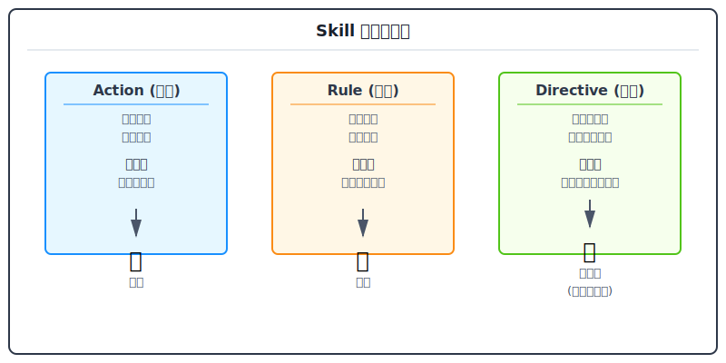

# Skill-0: Skill Decomposition Parser

[English](README.md)

> 一個解析 Claude Skills 與 MCP Tools 內部結構的三元分類系統

[](https://www.python.org/downloads/)
[](https://opensource.org/licenses/MIT)
[](schema/skill-decomposition.schema.json)

## Overview 概述

Skill-0 是一個分類系統，用於將 AI/Chatbot Skills（特別是 Claude Skills 和 MCP Tools）解析為結構化的組件。包含**語義搜尋**功能，透過向量嵌入實現智慧 skill 探索。

## Ternary Classification System 三元分類法

將 Skill 中不可變的部分（或修改後會改變行為的部分）組織並定義為三個類別：



| Category | Definition | Characteristics |
|----------|------------|-----------------|
| **Action** (動作) | 原子操作：不可再分解的基礎操作 | 確定性結果、無條件分支、原子操作 |
| **Rule** (規則) | 原子判斷：純粹的條件判斷/分類 | 回傳布林值/分類結果、條件評估 |
| **Directive** (指示) | 描述性語句：可分解但在此層次選擇不分解 | 包含完成狀態、知識、原則、限制等 |

### Directive Types 指示類型

| Type | Description | Example |
|------|-------------|---------|
| `completion` | 完成狀態描述 | 「表格已全部提取」 |
| `knowledge` | 領域知識 | 「PDF 格式規範」 |
| `principle` | 指導原則 | 「優化 Context Window」 |
| `constraint` | 限制條件 | 「最大 25,000 tokens」 |
| `preference` | 偏好設定 | 「使用者偏好 JSON 格式」 |
| `strategy` | 策略方針 | 「錯誤時重試三次」 |

### Directive Provenance（可選）

由於 Skills/Tools 可能來自不同來源，且常無法向原始作者確認真實意圖，為了最大限度保留原有精神，`Directive` 可選擇附帶 `provenance`（來源追溯）並分成兩層級：

- `basic`：最小可追溯 + 原句摘錄
- `full`：再加上位置與提取/轉譯資訊（後端可依此判斷如何編碼）

**Basic**

```json
"provenance": {
  "level": "basic",
  "source": { "kind": "mcp_tool", "ref": "example-tool" },
  "original_text": "偏好輸出精簡"
}
```

**Full**

```json
"provenance": {
  "level": "full",
  "source": { "kind": "claude_skill", "ref": "converted-skills/docx/SKILL.md", "version": "v1" },
  "original_text": "修改要最小化",
  "location": { "locator": "SKILL.md#L120" },
  "extraction": { "method": "llm", "inferred": true, "confidence": 0.7 }
}
```

### ID Format ID 格式

| Element | Pattern | Example |
|---------|---------|---------|
| Action | `a_XXX` | `a_001`, `a_002` |
| Rule | `r_XXX` | `r_001`, `r_002` |
| Directive | `d_XXX` | `d_001`, `d_002` |

## Project Structure 專案結構

```
skill-0/
├── api/                               # REST API（FastAPI，port 8000）
│   ├── main.py                       # 主要 API（JWT 驗證與速率限制）
│   └── logging_config.py            # 結構化日誌（structlog）
├── vector_db/                         # 向量資料庫模組
│   ├── embedder.py                   # 嵌入產生器（all-MiniLM-L6-v2）
│   ├── vector_store.py               # SQLite-vec 儲存
│   └── search.py                     # 語義搜尋引擎
├── skill-0-dashboard/                 # 治理儀表板
│   └── apps/
│       ├── api/                      # 儀表板 API（FastAPI，port 8001）
│       └── web/                      # React 19 + Vite 前端
├── governance/                        # 治理系統
│   └── db/governance.db              # Skill 審核工作流程 DB
├── schema/                            # JSON Schema v2.4
├── parsed/                            # 已解析的 skill 範例（32 skills）
├── tools/                             # 分析與治理工具
├── scripts/                           # 維護腳本
├── tests/                             # 測試套件（111+ 項測試）
├── docker-compose.yml                 # 開發環境 Docker 設定
├── docker-compose.prod.yml            # 正式環境 Docker 設定
├── Dockerfile.{api,dashboard,web}     # 容器映像
└── skills.db                          # 向量資料庫
```

## Installation 安裝

```bash
# 克隆儲存庫
git clone https://github.com/pingqLIN/skill-0.git
cd skill-0

# 安裝依賴
pip install sqlite-vec sentence-transformers scikit-learn

# 索引 skills（首次使用）
python -m vector_db.search --db skills.db --parsed-dir parsed index
```

## Semantic Search 語義搜尋

Skill-0 包含強大的語義搜尋引擎，由 `all-MiniLM-L6-v2` 嵌入模型和 `SQLite-vec` 驅動。

### CLI Commands CLI 命令

```bash
# 索引所有 skills
python -m vector_db.search --db skills.db --parsed-dir parsed index

# 自然語言搜尋
python -m vector_db.search --db skills.db search "PDF 文件處理"

# 找相似的 skills
python -m vector_db.search --db skills.db similar "Docx Skill"

# 聚類分析（自動分群）
python -m vector_db.search --db skills.db cluster -n 5

# 顯示統計
python -m vector_db.search --db skills.db stats
```

### Search Examples 搜尋範例

```bash
$ python -m vector_db.search search "創意設計視覺藝術"

🔍 Searching for: 創意設計視覺藝術
--------------------------------------------------
1. Canvas-Design Skill (53.36%)
2. Theme Factory (46.14%)
3. Anthropic Brand Styling (45.54%)
4. Slack GIF Creator (45.44%)
5. Pptx Skill (45.08%)

Search completed in 72.6ms
```

### Python API

```python
from vector_db import SemanticSearch

# 初始化搜尋引擎
search = SemanticSearch(db_path='skills.db')

# 語義搜尋
results = search.search("PDF 處理", limit=5)
for r in results:
    print(f"{r['name']}: {r['similarity']:.2%}")

# 找相似 skills
similar = search.find_similar("Docx Skill", limit=5)

# 聚類分析
clusters = search.cluster_skills(n_clusters=5)
```

## Quick Example 快速範例

```json
{
  "decomposition": {
    "actions": [
      {
        "id": "a_001",
        "name": "Read PDF",
        "action_type": "io_read",
        "deterministic": true
      }
    ],
    "rules": [
      {
        "id": "r_001",
        "name": "Check File Exists",
        "condition_type": "existence_check",
        "returns": "boolean"
      }
    ],
    "directives": [
      {
        "id": "d_001",
        "name": "PDF Processing Complete",
        "directive_type": "completion",
        "description": "All tables extracted and saved to Excel",
        "decomposable": true
      }
    ]
  }
}
```

## Statistics 統計 (32 Skills)

| Metric 指標 | Count 數量 |
|--------|-------|
| **Skills** | 32 |
| **Actions** | 266 |
| **Rules** | 84 |
| **Directives** | 120 |
| **Action Type Coverage** | 100% |
| **Directive Type Coverage** | 100% |

### Cluster Distribution 聚類分布

| Cluster | Skills | Description 描述 |
|---------|--------|-------------|
| 1 | 10 | 開發工具 (MCP, Testing) |
| 2 | 5 | 文件處理 (PDF, DOCX) |
| 3 | 7 | 創意設計 (Canvas, Theme) |
| 4 | 2 | 數據分析 (Excel, Raffle) |
| 5 | 8 | 研究助理 (Leads, Resume) |

## Performance 效能

| Metric 指標 | Value 數值 |
|--------|-------|
| Index Time 索引時間 | 0.88s (32 skills) |
| Search Latency 搜尋延遲 | ~75ms |
| Embedding Dimension 向量維度 | 384 |
| Database 資料庫 | SQLite-vec |

## Version 版本

- Schema Version: 2.4.0
- Created: 2026-01-23
- Updated: 2026-02-26
- Author: pingqLIN

## Changelog 更新紀錄

### v2.4.0 (2026-02-26) - 安全性、測試與正式環境就緒
- **安全性**: 兩個 API 伺服器均加入 JWT 驗證
- **安全性**: 速率限制（各端點獨立控制）
- **安全性**: CORS 透過環境變數設定
- **安全性**: 正式環境安全強制執行（設定錯誤時快速失敗）
- **監控**: Prometheus 指標端點（`/metrics`）
- **監控**: 使用 structlog 進行結構化日誌（JSON/console 輸出）
- **測試**: 新增 79 項測試（總計 111+ 項）— 儀表板 API、驗證流程、速率限制、前端
- **DevOps**: Docker 容器化（3 個 Dockerfile + docker-compose）
- **DevOps**: CI/CD 流程（pytest-cov、Web 建置、Docker 建置驗證）
- **工具**: 附治理交叉參照的向量 DB 同步腳本
- **Schema**: v2.4.0 加入 Hive 啟發功能（品質信號、成功條件、失敗模式）

### v2.1.0 (2026-01-26) - Stage 2
- **新功能**: 向量嵌入語義搜尋
  - `vector_db` 模組與 SQLite-vec 整合
  - `all-MiniLM-L6-v2` 嵌入模型 (384 維)
  - K-Means 聚類 skill 分群
  - CLI 工具: `python -m vector_db.search`
- 擴展至 32 skills (+21 來自 awesome-claude-skills)
- 效能: 0.88s 索引, ~75ms 搜尋

### v2.0.0 (2026-01-26)
- **Breaking Change**: 重新定義三元分類
  - `core_action` → `action` (ID: `ca_XXX` → `a_XXX`)
  - `mission` → `directive` (ID: `m_XXX` → `d_XXX`)
- 新增 `directive_type` 支援：completion, knowledge, principle, constraint, preference, strategy
- 新增 `decomposable` 和 `decomposition_hint` 欄位
- 新增 `action_type`: `await_input`
- Schema 結構優化

### v1.1.0 (2026-01-23)
- 初始版本

## License 授權

MIT
