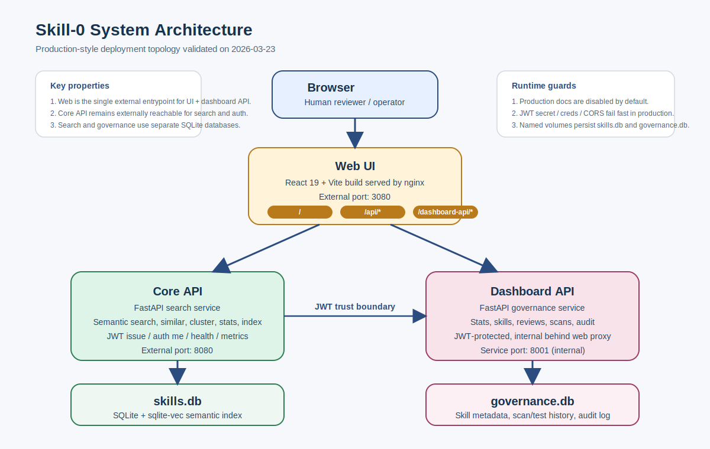
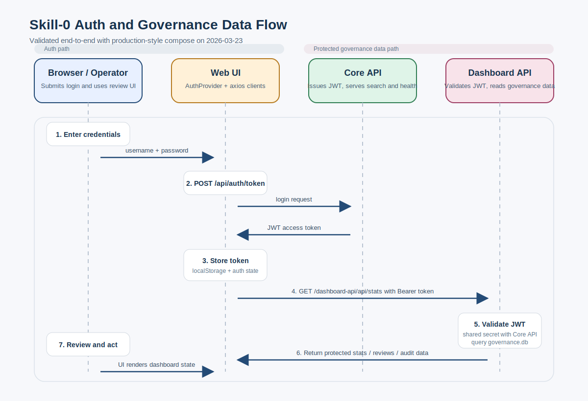

# 03. System Architecture and Runtime

## 3.1 High-Level Topology

目前 Skill-0 的系統由三個主要服務與兩個主要資料庫構成：



```text
Browser
  |
  v
Web UI (React/Vite bundle served by nginx)
  |
  +--> /api/* ------------> Core API (FastAPI)
  |
  +--> /dashboard-api/* --> Dashboard API (FastAPI)

Core API ---------> skills.db (SQLite + sqlite-vec)
Dashboard API ----> governance.db (SQLite)
```

在 production compose 下：

- Web 對外預設 port：`3080`
- Core API 對外預設 port：`8080`
- Dashboard API 為內部服務，由 web 反向代理進入

圖 1 對應的是 production-style compose 的實際部署拓樸，而不是單純概念圖。也就是說，它反映的是目前已被 smoke test 驗證過的部署形態。

## 3.2 Main Runtime Components

### Core API

職責：

- 提供 skill 搜尋、相似技能查找、聚類、統計
- 提供 re-index 管理操作
- 提供 JWT token 簽發與驗證相關端點
- 提供 health 與 metrics

主要入口：

- `api/main.py`

依賴：

- `vector_db/search.py`
- `vector_db/embedder.py`
- `vector_db/vector_store.py`

### Dashboard API

職責：

- 包裝治理資料庫與治理流程
- 提供 stats、skills、reviews、scans、audit 等端點
- 驗證 JWT，作為 dashboard web 的後端

主要入口：

- `skill-0-dashboard/apps/api/main.py`

核心 service：

- `skill-0-dashboard/apps/api/services/governance.py`

### Web UI

職責：

- 提供管理後台操作介面
- 透過 JWT 與 dashboard API 互動
- 透過 core API 進行登入與 session 初始化

主要入口：

- `skill-0-dashboard/apps/web/src/App.tsx`

認證相關：

- `skill-0-dashboard/apps/web/src/auth/AuthProvider.tsx`
- `skill-0-dashboard/apps/web/src/api/client.ts`

## 3.3 Storage Design

### `skills.db`

用途：

- 儲存向量化後的技能資料
- 支援 semantic search 與 similarity lookup

特性：

- local-first
- 以 SQLite 為基底
- 透過 `sqlite-vec` 支援向量搜尋

### `governance.db`

用途：

- 儲存 skill metadata
- 儲存 security scan、equivalence tests、audit log
- 儲存 skill approval workflow 狀態

這個 DB 與 `skills.db` 分離，代表搜尋層與治理層是兩套邏輯資料域。

優點：

- 關注點分離
- dashboard 不需直接碰向量庫

代價：

- skill identity 需要應用層維持一致
- 備份與恢復要同時考慮兩套資料

## 3.4 Core Request Flow

### Search flow

1. 客戶端呼叫 core API 搜尋端點
2. API 建立或取得 `SemanticSearch`
3. query 進入 embedder 生成向量
4. 向量送進 `VectorStore`
5. SQLite-vec 回傳近鄰結果
6. API 將距離轉為 similarity 並回傳

### Governance dashboard flow



1. 使用者在 web login
2. web 對 core API 的 `/api/auth/token` 送出帳密
3. 取得 JWT 後存入前端 storage
4. dashboard API client 對後續 `/dashboard-api/api/*` 自動附帶 Bearer token
5. Dashboard API 透過 shared JWT secret 驗證 token
6. GovernanceService 讀寫 `governance.db`
7. 前端頁面呈現統計、審核、稽核與掃描結果

圖 2 強調的是目前系統中的 auth 與治理資料路徑：

- core API 負責簽發 JWT
- web 負責保存 token 與攜帶 Bearer header
- dashboard API 負責驗證 JWT 並查詢治理資料

## 3.5 Security and Runtime Guards

### Production fail-fast

core API 與 dashboard API 都具備 production 啟動檢查。

目前會檢查至少這些條件：

- `JWT_SECRET_KEY` 不可仍是開發預設值
- production 不可保留 localhost / wildcard CORS
- core API 在 production 下要求設定帳密

### Docs toggle

兩個 FastAPI app 都透過 `SKILL0_ENABLE_DOCS` 控制：

- development 預設可開啟 docs
- production 預設關閉 docs / redoc / openapi

### Path whitelist

dashboard governance service 對 `source_path` / `installed_path` 增加 allowed roots 驗證，避免治理操作跨出受控目錄。

## 3.6 Production Compose Design

`docker-compose.prod.yml` 現在已經被修成可獨立使用的 production compose，而不是依賴 base compose 疊加。

它的特點包括：

- 服務 build definition 直接在 prod compose 中定義
- `api` 使用 `/app/data/skills.db`
- `dashboard` 使用 `/app/governance/db/governance.db`
- `web` 依賴 `api` 與 `dashboard` 健康後再啟動
- `web` 對外預設 port 為 `3080`
- `api` 對外預設 port 為 `8080`
- `skills.db`、`governance.db`、model cache 皆改用 named volumes

## 3.7 Runtime Validation Baseline

目前已完成的 runtime smoke test 包括：

- compose build 成功
- compose up 成功
- API / dashboard / web 三者都達到 `healthy`
- core API health 成功
- dashboard health 成功
- web 首頁回應成功
- login 取得 JWT 成功
- 帶 token 存取 dashboard stats 成功
- compose restart 後資料與健康狀態仍能恢復

## 3.8 Architectural Strengths and Limits

### Strengths

- 架構切分清楚
- 搜尋與治理職責分離
- local-first，部署成本低
- 對外審核時可明確展示資料流與控制點

### Limits

- 雙 SQLite 架構需要應用層維持一致性
- 冷啟動與模型下載仍是實際營運風險
- rate limiting 仍是記憶體內實作，不適合多副本
- 長期若 skill 數量與請求量上升，需重新考慮資料庫與 embedding runtime
