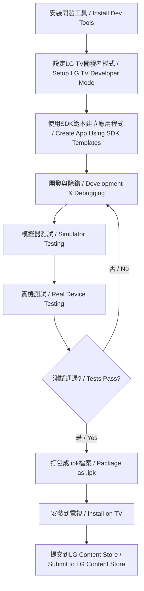

# LG OLED TV Hue Sync 應用程式開發計畫書
# LG OLED TV Hue Sync Application Development Plan

**文件版本 / Document Version**: 1.0  
**建立日期 / Created**: 2026-02-01  
**目標裝置 / Target Device**: LG OLED TV (2017年後 / 2017 onwards)  
**參考應用 / Reference App**: Philips Hue Sync TV App

---

## 目錄 / Table of Contents

1. [專案概述 / Project Overview](#專案概述--project-overview)
2. [開發環境背景研究 / Development Environment Research](#開發環境背景研究--development-environment-research)
3. [目標程式技術研究 / Target Technology Research](#目標程式技術研究--target-technology-research)
4. [技術架構設計 / Technical Architecture](#技術架構設計--technical-architecture)
5. [開發路線圖 / Development Roadmap](#開發路線圖--development-roadmap)
6. [風險評估與對策 / Risk Assessment](#風險評估與對策--risk-assessment)
7. [資源需求 / Resource Requirements](#資源需求--resource-requirements)

---

## 專案概述 / Project Overview

### 專案目標 / Project Goals

開發一個能夠安裝於LG 2017年之後的OLED電視的應用程式，提供類似Philips Hue Sync TV App的智慧燈光同步功能。

Develop an application installable on LG OLED TVs from 2017 onwards, providing smart lighting synchronization functionality similar to the Philips Hue Sync TV App.

### 核心功能需求 / Core Functional Requirements

1. **即時環境光同步 / Real-Time Ambient Lighting Sync**
   - 將電視螢幕內容與智慧燈光同步
   - 支援影片、遊戲、音樂等多種內容類型
   - Synchronize TV screen content with smart lights
   - Support movies, games, music, and other content types

2. **原生整合 / Native Integration**
   - 直接在LG TV上運行，無需外部硬體
   - 支援所有原生TV內容源
   - Run directly on LG TV without external hardware
   - Support all native TV content sources

3. **高階格式支援 / Advanced Format Support**
   - 支援4K、8K、HDR10、Dolby Vision等格式
   - 精準的視覺同步
   - Support 4K, 8K, HDR10, Dolby Vision formats
   - Precise visual synchronization

4. **自訂照明模式 / Customizable Lighting Modes**
   - 電影模式、遊戲模式等預設模式
   - 可自訂燈光效果參數
   - Preset modes for movies, games, etc.
   - Customizable lighting effect parameters

5. **多燈同步 / Multi-Light Synchronization**
   - 支援同步多個智慧燈具
   - 創建複雜動態房間照明
   - Support synchronization of multiple smart lights
   - Create complex dynamic room lighting

---

## 開發環境背景研究 / Development Environment Research

### LG webOS TV 平台概述 / LG webOS TV Platform Overview

#### 支援的電視型號與作業系統版本 / Supported TV Models and OS Versions

| 年份 / Year | webOS 版本 / Version | 支援裝置 / Supported Devices |
|-------------|---------------------|----------------------------|
| 2017 | webOS 3.0, 3.5 | LG OLED B7, C7, E7, G7, W7 系列 |
| 2018 | webOS 4.0 | LG OLED B8, C8, E8, W8 系列 |
| 2019 | webOS 4.5 | LG OLED B9, C9, E9, W9, Z9 系列 |
| 2020 | webOS 5.0 | LG OLED BX, CX, GX, WX, ZX 系列 |
| 2021 | webOS 6.0 | LG OLED A1, B1, C1, G1, Z1 系列 |
| 2022+ | webOS 22+ | LG OLED B2, C2, G2, C3, G3 等最新系列 |

### 開發工具與環境 / Development Tools and Environment

#### 1. 核心開發工具 / Core Development Tools

**webOS CLI (Command Line Interface)**
- 用於建立、打包、安裝和啟動webOS TV應用程式的核心命令列工具
- 取代舊版的webOS TV CLI
- Core command-line tool for creating, packaging, installing, and launching webOS TV apps
- Replaces the older webOS TV CLI

**webOS Studio**
- Visual Studio Code的擴充套件
- 提供圖形化介面進行應用程式開發、打包和部署
- Extension for Visual Studio Code
- Provides GUI for app development, packaging, and deployment

**webOS TV Simulator**
- 在電腦上測試和除錯應用程式，無需實體電視
- webOS TV 22+（2022年後）使用Simulator取代Emulator
- Test and debug apps on computer without physical TV
- For webOS TV 22+, Simulator replaces Emulator

**Beanviser**
- 效能分析工具，用於應用程式效能分析
- Performance analysis tool for app profiling

#### 2. 系統需求 / System Requirements

- **作業系統 / OS**: Windows, macOS, Linux (最新發行版 / recent distributions)
- **Node.js**: 版本 14.15.1–16.20.2
- **npm**: 需要與Node.js一起安裝 / Required with Node.js
- **Visual Studio Code**: 用於webOS Studio擴充套件 / For webOS Studio extension

#### 3. 開發語言與API / Development Languages and APIs

**Web Technologies**
- HTML5
- CSS3
- JavaScript / TypeScript
- 標準現代Web API / Standard modern Web APIs

**webOS特定API / webOS-Specific APIs**
- **webOS.JS Library**: TV特定功能和服務 / TV-specific features and services
- **Luna Service API**: 與作業系統和裝置硬體深度整合 / Deep integration with OS and device hardware

### 向後相容性考量 / Backward Compatibility Considerations

#### 關鍵技術轉換點 / Key Technical Transition Points

1. **webOS 2.x → 3.x (2016-2017)**
   - 作業系統核心重新設計 / OS kernel redesign
   - Web引擎從WebKit遷移到Blink / Web engine migration from WebKit to Blink
   - **不向後相容 / Not backward compatible**

2. **webOS 3.x → 4.x (2018)**
   - 智慧家居和語音助理整合的重大變更 / Major changes for smart home and voice assistant integration
   - **不向後相容 / Not backward compatible**

#### 相容性策略 / Compatibility Strategy

**支援webOS 3.0+ (2017年後所有電視 / All TVs from 2017 onwards)**

需要遵循以下開發指南：
Following development guidelines are required:

1. **JavaScript 相容性 / JavaScript Compatibility**
   - 使用 `addEventListener()` 方法而非直接屬性賦值
   - 避免使用僅在較新版本可用的ES6+功能
   - Use `addEventListener()` method instead of direct property assignment
   - Avoid ES6+ features only available in newer versions

2. **CSS 相容性 / CSS Compatibility**
   - 同時使用帶前綴（`-webkit-`）和標準的CSS屬性
   - 確保flexbox、animation等現代CSS模組的相容性
   - Use both prefixed (`-webkit-`) and standard CSS properties
   - Ensure compatibility for modern CSS modules like flexbox, animation

3. **功能偵測 / Feature Detection**
   - 使用功能偵測而非版本檢查
   - 優雅降級不支援的功能
   - Use feature detection instead of version checks
   - Gracefully degrade unsupported features

4. **測試策略 / Testing Strategy**
   - 在每個主要webOS版本上測試應用程式
   - 使用參考裝置進行實機測試
   - Test app on each major webOS version
   - Use reference devices for real device testing

### 開發流程 / Development Workflow



---

## 目標程式技術研究 / Target Technology Research

### Philips Hue Sync TV App 功能分析 / Philips Hue Sync TV App Feature Analysis

#### 核心功能 / Core Features

1. **即時環境照明 / Real-Time Ambient Lighting**
   - 將Philips Hue智慧燈與電視內容即時同步
   - 創造沉浸式照明效果，將螢幕色彩和氛圍延伸到房間
   - 類似Philips電視的"Ambilight"效果
   - Syncs Philips Hue smart lights with TV content in real-time
   - Creates immersive lighting effects extending screen colors into room
   - Similar to "Ambilight" effect on Philips TVs

2. **原生LG TV整合 / Native LG TV Integration**
   - 無需外部HDMI Sync Box
   - 直接在LG TV上運行（webOS 24，2024年型號及更新版本）
   - 簡化設定，減少硬體雜亂
   - No external HDMI Sync Box required
   - Runs directly on LG TV (webOS 24, 2024 models and newer)
   - Simplified setup, reduced hardware clutter

3. **相容性 / Compatibility**
   - 支援彩色Philips Hue燈具
   - 需要Philips Hue Bridge
   - 支援所有類型的原生TV內容（串流應用、機上盒、藍光播放器、遊戲機）
   - Works with color-capable Philips Hue lights
   - Requires Philips Hue Bridge
   - Supports all native TV content types (streaming apps, set-top boxes, Blu-ray, gaming consoles)

4. **高階格式支援 / Advanced Format Support**
   - 支援8K、4K、HDR10、Dolby Vision內容
   - 視覺精準同步
   - Supports 8K, 4K, HDR10, Dolby Vision content
   - Visually precise synchronization

5. **可自訂照明模式 / Customizable Lighting Modes**
   - 電影專用模式
   - 遊戲專用模式
   - 每種模式針對該類型內容優化燈光同步
   - Dedicated movie mode
   - Dedicated game mode
   - Each mode optimizes light syncing for content type

6. **多燈同步 / Multi-Light Synchronization**
   - 可同步最多10個Hue燈具
   - 創造複雜且動態的房間照明，匹配每個場景
   - Sync up to 10 Hue lights
   - Create complex, dynamic room lighting matching every scene

#### 設定流程 / Setup Process

1. 確認LG TV相容性（webOS 24+）
2. 從LG TV應用程式商店安裝Philips Hue Sync TV應用程式
3. 透過Hue Bridge連接TV和Hue系統
4. 在Hue應用程式中設定娛樂區域，包含彩色Hue燈具

1. Ensure LG TV compatibility (webOS 24+)
2. Install Philips Hue Sync TV app from LG TV app store
3. Connect TV and Hue system through Hue Bridge
4. Set up Entertainment Area in Hue app with color-capable lights

#### 價格模式 / Pricing Model

- **一次性購買 / One-time purchase**: $129.99 / €129.99（單一電視）
- **訂閱制 / Subscription**: $2.99 / €2.99 每月（最多三台電視）
- **地區 / Regions**: 全球可用（北美、歐洲、亞太、中東）

### 技術實作分析 / Technical Implementation Analysis

#### 關鍵技術挑戰 / Key Technical Challenges

1. **即時視訊分析 / Real-Time Video Analysis**
   - 需要高效能的影像處理演算法
   - 從視訊畫面中提取主要色彩和亮度資訊
   - 低延遲處理（<100ms）以確保同步體驗
   - Requires high-performance image processing algorithms
   - Extract dominant colors and brightness from video frames
   - Low latency processing (<100ms) for synchronized experience

2. **智慧燈具通訊協定 / Smart Light Communication Protocol**
   - 整合Philips Hue API或類似智慧燈具系統
   - 支援區域網路通訊（WiFi/Ethernet）
   - 實作可靠的裝置發現和配對機制
   - Integrate Philips Hue API or similar smart lighting systems
   - Support local network communication (WiFi/Ethernet)
   - Implement reliable device discovery and pairing

3. **效能優化 / Performance Optimization**
   - 在電視有限的處理能力下維持流暢體驗
   - 平衡視訊分析精度與處理效能
   - 記憶體管理和資源釋放
   - Maintain smooth experience on TV's limited processing power
   - Balance video analysis precision with processing performance
   - Memory management and resource cleanup

4. **使用者體驗設計 / User Experience Design**
   - 簡化的設定流程
   - 直覺的遙控器操作介面
   - 清晰的視覺回饋和狀態指示
   - Simplified setup process
   - Intuitive remote control interface
   - Clear visual feedback and status indicators

---

## 技術架構設計 / Technical Architecture

### 系統架構圖 / System Architecture Diagram

```
┌─────────────────────────────────────────────────────────┐
│                   LG webOS TV 應用程式                    │
│                   LG webOS TV Application                │
├─────────────────────────────────────────────────────────┤
│                                                           │
│  ┌───────────────────────────────────────────────────┐  │
│  │          UI Layer (使用者介面層)                    │  │
│  │          - React/Vue.js Frontend                   │  │
│  │          - Remote Control Navigation              │  │
│  │          - Settings & Configuration UI            │  │
│  └───────────────────────────────────────────────────┘  │
│                          │                               │
│  ┌───────────────────────────────────────────────────┐  │
│  │      Application Logic Layer (應用邏輯層)          │  │
│  │      - Video Analysis Service                      │  │
│  │      - Color Extraction Engine                     │  │
│  │      - Sync Control Manager                        │  │
│  │      - Configuration Manager                       │  │
│  └───────────────────────────────────────────────────┘  │
│                          │                               │
│  ┌───────────────────────────────────────────────────┐  │
│  │      Platform Integration Layer (平台整合層)       │  │
│  │      - webOS.JS API Integration                    │  │
│  │      - Luna Service API                            │  │
│  │      - Media Access & Control                      │  │
│  └───────────────────────────────────────────────────┘  │
│                          │                               │
│  ┌───────────────────────────────────────────────────┐  │
│  │      Network Layer (網路層)                        │  │
│  │      - HTTP/HTTPS Client                          │  │
│  │      - WebSocket Support                          │  │
│  │      - Device Discovery (mDNS/SSDP)              │  │
│  └───────────────────────────────────────────────────┘  │
│                          │                               │
└──────────────────────────┼───────────────────────────────┘
                           │
                    Local Network
                           │
┌──────────────────────────┼───────────────────────────────┐
│                          │                               │
│  ┌───────────────────────────────────────────────────┐  │
│  │       Smart Light Hub / Bridge                     │  │
│  │       - Philips Hue Bridge                        │  │
│  │       - Other Smart Lighting Systems              │  │
│  │       - API Gateway                               │  │
│  └───────────────────────────────────────────────────┘  │
│                          │                               │
│  ┌───────────────────────────────────────────────────┐  │
│  │       Smart Lights (智慧燈具)                      │  │
│  │       - RGB/RGBW Color Bulbs                      │  │
│  │       - LED Strips                                │  │
│  │       - Light Fixtures                            │  │
│  └───────────────────────────────────────────────────┘  │
│                                                           │
└───────────────────────────────────────────────────────────┘
```

### 核心模組設計 / Core Module Design

#### 1. Video Analysis Module (視訊分析模組)

**功能 / Functions:**
- 從當前顯示畫面擷取影像資料
- 分析影像主要色彩和亮度
- 計算最佳燈光色彩和亮度值

**技術實作 / Technical Implementation:**
```javascript
// 偽代碼示例 / Pseudo-code Example
class VideoAnalyzer {
  constructor(config) {
    this.samplingRate = config.samplingRate || 30; // FPS
    this.analysisMethod = config.analysisMethod || 'dominant-color';
  }
  
  captureFrame() {
    // 使用 webOS API 擷取當前畫面
    // Capture current frame using webOS API
    return webOS.screen.capture();
  }
  
  analyzeFrame(frame) {
    // 使用色彩分析演算法
    // Use color analysis algorithm
    const colors = this.extractDominantColors(frame);
    const brightness = this.calculateBrightness(frame);
    
    return {
      colors: colors,
      brightness: brightness,
      timestamp: Date.now()
    };
  }
  
  extractDominantColors(frame) {
    // 實作 K-means 或其他聚類演算法
    // Implement K-means or other clustering algorithms
    // ...
  }
}
```

#### 2. Light Control Module (燈光控制模組)

**功能 / Functions:**
- 與智慧燈具系統通訊
- 控制燈光色彩、亮度、過渡效果
- 管理多個燈具的同步

**技術實作 / Technical Implementation:**
```javascript
// 偽代碼示例 / Pseudo-code Example
class LightController {
  constructor(bridgeIP, apiKey) {
    this.bridgeIP = bridgeIP;
    this.apiKey = apiKey;
    this.lights = [];
  }
  
  async discoverLights() {
    // 發現區域網路中的智慧燈具
    // Discover smart lights on local network
    const response = await fetch(`http://${this.bridgeIP}/api/${this.apiKey}/lights`);
    this.lights = await response.json();
  }
  
  async updateLight(lightId, color, brightness) {
    // 更新特定燈具的狀態
    // Update specific light state
    const payload = {
      on: true,
      bri: brightness,
      hue: color.hue,
      sat: color.saturation,
      transitiontime: 1 // 100ms
    };
    
    await fetch(
      `http://${this.bridgeIP}/api/${this.apiKey}/lights/${lightId}/state`,
      {
        method: 'PUT',
        body: JSON.stringify(payload)
      }
    );
  }
  
  async syncAll(analysisResult) {
    // 同步所有燈具
    // Sync all lights
    const promises = this.lights.map(light => 
      this.updateLight(light.id, analysisResult.colors[0], analysisResult.brightness)
    );
    await Promise.all(promises);
  }
}
```

#### 3. Sync Manager Module (同步管理模組)

**功能 / Functions:**
- 協調視訊分析和燈光控制
- 管理同步延遲和緩衝
- 處理不同內容模式（電影、遊戲、音樂）

**技術實作 / Technical Implementation:**
```javascript
// 偽代碼示例 / Pseudo-code Example
class SyncManager {
  constructor(videoAnalyzer, lightController) {
    this.videoAnalyzer = videoAnalyzer;
    this.lightController = lightController;
    this.isRunning = false;
    this.mode = 'movie'; // 'movie', 'game', 'music'
  }
  
  start() {
    this.isRunning = true;
    this.syncLoop();
  }
  
  stop() {
    this.isRunning = false;
  }
  
  async syncLoop() {
    while (this.isRunning) {
      const frame = this.videoAnalyzer.captureFrame();
      const analysis = this.videoAnalyzer.analyzeFrame(frame);
      
      // 根據模式調整分析結果
      // Adjust analysis result based on mode
      const adjusted = this.applyModePreset(analysis);
      
      await this.lightController.syncAll(adjusted);
      
      // 根據取樣率等待
      // Wait based on sampling rate
      await this.sleep(1000 / this.videoAnalyzer.samplingRate);
    }
  }
  
  applyModePreset(analysis) {
    switch (this.mode) {
      case 'movie':
        // 較慢的過渡，強調氛圍
        // Slower transitions, emphasize ambiance
        return { ...analysis, transitionTime: 5 };
      case 'game':
        // 快速反應，高對比
        // Fast response, high contrast
        return { ...analysis, transitionTime: 1, contrast: 1.5 };
      case 'music':
        // 基於音訊分析的節奏同步
        // Rhythm sync based on audio analysis
        return this.applyMusicSync(analysis);
      default:
        return analysis;
    }
  }
}
```

### 資料流程 / Data Flow

```
使用者啟動應用程式 / User starts app
        ↓
應用程式初始化 / App initialization
        ↓
發現並連接智慧燈具 / Discover and connect to smart lights
        ↓
使用者選擇同步模式 / User selects sync mode
        ↓
開始視訊分析迴圈 / Start video analysis loop
        ↓
┌────────────────────────────────────┐
│  每個畫面 / Every frame:            │
│  1. 擷取當前畫面 / Capture frame    │
│  2. 分析色彩和亮度 / Analyze colors │
│  3. 計算燈光參數 / Calculate params │
│  4. 傳送至燈具 / Send to lights     │
│  5. 等待下一個畫面 / Wait for next  │
└────────────────────────────────────┘
        ↓
使用者停止同步 / User stops sync
        ↓
清理資源 / Cleanup resources
```

---

## 開發路線圖 / Development Roadmap

### 階段一：基礎建置（1-2個月）/ Phase 1: Foundation (1-2 months)

#### 目標 / Goals
- 建立開發環境
- 實作基本應用程式架構
- 完成平台整合

#### 任務清單 / Task List

- [ ] **環境設定 / Environment Setup**
  - [ ] 安裝webOS CLI、webOS Studio
  - [ ] 設定開發用LG TV（開發者模式）
  - [ ] 配置版本控制系統（Git）
  - [ ] Install webOS CLI, webOS Studio
  - [ ] Setup development LG TV (developer mode)
  - [ ] Configure version control system (Git)

- [ ] **專案初始化 / Project Initialization**
  - [ ] 使用webOS SDK建立專案範本
  - [ ] 設定專案結構和模組架構
  - [ ] 配置建置和打包流程
  - [ ] Create project template using webOS SDK
  - [ ] Setup project structure and module architecture
  - [ ] Configure build and packaging process

- [ ] **基本UI開發 / Basic UI Development**
  - [ ] 設計應用程式主介面
  - [ ] 實作遙控器導航邏輯
  - [ ] 建立設定頁面
  - [ ] Design app main interface
  - [ ] Implement remote control navigation
  - [ ] Create settings page

- [ ] **平台API整合 / Platform API Integration**
  - [ ] 整合webOS.JS Library
  - [ ] 測試Luna Service API存取
  - [ ] 實作媒體存取權限
  - [ ] Integrate webOS.JS Library
  - [ ] Test Luna Service API access
  - [ ] Implement media access permissions

**交付成果 / Deliverables:**
- 可在LG TV上運行的基本應用程式
- 完整的開發環境和工作流程
- Basic app running on LG TV
- Complete development environment and workflow

### 階段二：核心功能開發（2-3個月）/ Phase 2: Core Features (2-3 months)

#### 目標 / Goals
- 實作視訊分析功能
- 開發燈光控制系統
- 整合同步管理

#### 任務清單 / Task List

- [ ] **視訊分析模組 / Video Analysis Module**
  - [ ] 實作畫面擷取功能
  - [ ] 開發色彩提取演算法
  - [ ] 優化處理效能（目標：<50ms延遲）
  - [ ] Implement frame capture
  - [ ] Develop color extraction algorithms
  - [ ] Optimize processing performance (target: <50ms latency)

- [ ] **智慧燈具整合 / Smart Light Integration**
  - [ ] 研究並選擇支援的燈具系統（Philips Hue優先）
  - [ ] 實作裝置發現機制（mDNS/SSDP）
  - [ ] 開發燈具控制API介面
  - [ ] 實作配對和認證流程
  - [ ] Research and select supported lighting systems (Philips Hue priority)
  - [ ] Implement device discovery (mDNS/SSDP)
  - [ ] Develop light control API interface
  - [ ] Implement pairing and authentication flow

- [ ] **同步引擎 / Sync Engine**
  - [ ] 實作即時同步迴圈
  - [ ] 開發延遲補償機制
  - [ ] 建立多燈協調系統
  - [ ] Implement real-time sync loop
  - [ ] Develop latency compensation
  - [ ] Build multi-light coordination system

- [ ] **效能優化 / Performance Optimization**
  - [ ] 記憶體使用分析和優化
  - [ ] CPU負載平衡
  - [ ] 網路傳輸優化
  - [ ] Memory usage analysis and optimization
  - [ ] CPU load balancing
  - [ ] Network transmission optimization

**交付成果 / Deliverables:**
- 功能完整的視訊同步系統
- 支援主流智慧燈具的控制
- Fully functional video sync system
- Support for mainstream smart lights

### 階段三：進階功能（1-2個月）/ Phase 3: Advanced Features (1-2 months)

#### 目標 / Goals
- 實作多種同步模式
- 增強使用者體驗
- 支援進階視訊格式

#### 任務清單 / Task List

- [ ] **同步模式 / Sync Modes**
  - [ ] 電影模式（強調氛圍，慢速過渡）
  - [ ] 遊戲模式（快速反應，高對比）
  - [ ] 音樂模式（節奏同步）
  - [ ] 自訂模式（使用者可調參數）
  - [ ] Movie mode (ambient, slow transitions)
  - [ ] Game mode (fast response, high contrast)
  - [ ] Music mode (rhythm sync)
  - [ ] Custom mode (user-adjustable parameters)

- [ ] **高階格式支援 / Advanced Format Support**
  - [ ] HDR10處理
  - [ ] Dolby Vision支援
  - [ ] 4K/8K高解析度優化
  - [ ] HDR10 processing
  - [ ] Dolby Vision support
  - [ ] 4K/8K high-resolution optimization

- [ ] **智慧功能 / Smart Features**
  - [ ] 場景自動偵測（動作、對話、夜景等）
  - [ ] 學習使用者偏好
  - [ ] 預設場景模板
  - [ ] Scene auto-detection (action, dialogue, night scenes, etc.)
  - [ ] Learn user preferences
  - [ ] Preset scene templates

- [ ] **使用者體驗增強 / UX Enhancement**
  - [ ] 即時預覽功能
  - [ ] 詳細的設定選項
  - [ ] 使用教學和提示
  - [ ] Real-time preview
  - [ ] Detailed settings options
  - [ ] Tutorial and tips

**交付成果 / Deliverables:**
- 多種同步模式可選
- 支援所有主流視訊格式
- Multiple sync modes available
- Support for all mainstream video formats

### 階段四：測試與優化（1-2個月）/ Phase 4: Testing & Optimization (1-2 months)

#### 目標 / Goals
- 全面測試應用程式
- 修復錯誤和問題
- 優化整體效能

#### 任務清單 / Task List

- [ ] **功能測試 / Functional Testing**
  - [ ] 測試所有核心功能
  - [ ] 驗證不同內容類型的同步效果
  - [ ] 測試多燈具配置
  - [ ] Test all core features
  - [ ] Verify sync effects for different content types
  - [ ] Test multi-light configurations

- [ ] **相容性測試 / Compatibility Testing**
  - [ ] 測試不同webOS版本（3.0, 3.5, 4.0, 4.5, 5.0+）
  - [ ] 測試不同OLED型號
  - [ ] 測試不同智慧燈具品牌
  - [ ] Test different webOS versions (3.0, 3.5, 4.0, 4.5, 5.0+)
  - [ ] Test different OLED models
  - [ ] Test different smart light brands

- [ ] **效能測試 / Performance Testing**
  - [ ] 長時間運行穩定性測試
  - [ ] 記憶體洩漏檢測
  - [ ] CPU和網路負載測試
  - [ ] Long-running stability tests
  - [ ] Memory leak detection
  - [ ] CPU and network load testing

- [ ] **使用者測試 / User Testing**
  - [ ] Beta測試計畫
  - [ ] 收集使用者回饋
  - [ ] 迭代改進
  - [ ] Beta testing program
  - [ ] Collect user feedback
  - [ ] Iterative improvements

**交付成果 / Deliverables:**
- 穩定、高效能的應用程式
- 完整的測試報告
- Stable, high-performance application
- Complete testing report

### 階段五：發佈與維護（持續）/ Phase 5: Release & Maintenance (Ongoing)

#### 目標 / Goals
- 提交到LG Content Store
- 持續維護和更新

#### 任務清單 / Task List

- [ ] **發佈準備 / Release Preparation**
  - [ ] 準備應用程式描述和截圖
  - [ ] 建立使用者文件
  - [ ] 準備隱私政策和服務條款
  - [ ] Prepare app description and screenshots
  - [ ] Create user documentation
  - [ ] Prepare privacy policy and terms of service

- [ ] **商店提交 / Store Submission**
  - [ ] 打包最終版本
  - [ ] 提交到LG Content Store
  - [ ] 通過審核流程
  - [ ] Package final version
  - [ ] Submit to LG Content Store
  - [ ] Pass review process

- [ ] **市場推廣 / Marketing**
  - [ ] 建立產品網站
  - [ ] 社群媒體宣傳
  - [ ] 使用者支援管道
  - [ ] Create product website
  - [ ] Social media promotion
  - [ ] User support channels

- [ ] **持續維護 / Ongoing Maintenance**
  - [ ] 錯誤修復更新
  - [ ] 新功能開發
  - [ ] 相容性更新（新webOS版本）
  - [ ] Bug fix updates
  - [ ] New feature development
  - [ ] Compatibility updates (new webOS versions)

**交付成果 / Deliverables:**
- 在LG Content Store上架的應用程式
- 持續的使用者支援和更新
- App published on LG Content Store
- Ongoing user support and updates

---

## 風險評估與對策 / Risk Assessment

### 技術風險 / Technical Risks

| 風險 / Risk | 影響 / Impact | 可能性 / Probability | 對策 / Mitigation |
|------------|--------------|---------------------|------------------|
| webOS API限制導致畫面擷取效能不足 / webOS API limitations causing insufficient frame capture performance | 高 / High | 中 / Medium | 1. 早期進行技術驗證<br>2. 探索替代實作方法<br>3. 與LG開發者支援團隊溝通<br>1. Early technical validation<br>2. Explore alternative implementations<br>3. Communicate with LG developer support |
| 向後相容性問題（舊版webOS） / Backward compatibility issues (older webOS) | 中 / Medium | 高 / High | 1. 完整的相容性測試策略<br>2. 使用功能偵測和優雅降級<br>3. 明確標示最低支援版本<br>1. Comprehensive compatibility testing<br>2. Use feature detection and graceful degradation<br>3. Clearly mark minimum supported version |
| 智慧燈具API變更或限制 / Smart light API changes or limitations | 中 / Medium | 中 / Medium | 1. 支援多個燈具品牌的抽象層<br>2. 密切關注API更新<br>3. 與燈具廠商建立聯繫<br>1. Abstraction layer for multiple light brands<br>2. Monitor API updates closely<br>3. Establish contact with light manufacturers |
| 效能優化困難（記憶體、CPU） / Performance optimization challenges (memory, CPU) | 高 / High | 中 / Medium | 1. 持續效能分析和優化<br>2. 實作多級緩存策略<br>3. 使用Web Workers進行背景處理<br>1. Continuous performance analysis<br>2. Implement multi-level caching<br>3. Use Web Workers for background processing |

### 商業風險 / Business Risks

| 風險 / Risk | 影響 / Impact | 可能性 / Probability | 對策 / Mitigation |
|------------|--------------|---------------------|------------------|
| 市場競爭（官方Hue Sync App） / Market competition (official Hue Sync App) | 高 / High | 高 / High | 1. 提供差異化功能（支援更多燈具品牌）<br>2. 更優惠的價格策略<br>3. 更好的使用者體驗<br>1. Offer differentiated features (support more light brands)<br>2. More competitive pricing<br>3. Better user experience |
| LG Content Store審核不通過 / LG Content Store review rejection | 高 / High | 低 / Low | 1. 提前了解審核標準<br>2. 確保符合所有技術要求<br>3. 準備詳細的測試報告<br>1. Understand review criteria in advance<br>2. Ensure compliance with all technical requirements<br>3. Prepare detailed testing reports |
| 使用者採用率低 / Low user adoption | 中 / Medium | 中 / Medium | 1. 清晰的價值主張和行銷<br>2. 提供免費試用期<br>3. 積極的社群互動<br>1. Clear value proposition and marketing<br>2. Offer free trial period<br>3. Active community engagement |

### 法律風險 / Legal Risks

| 風險 / Risk | 影響 / Impact | 可能性 / Probability | 對策 / Mitigation |
|------------|--------------|---------------------|------------------|
| 智慧財產權問題（專利、商標） / IP issues (patents, trademarks) | 高 / High | 低 / Low | 1. 進行專利檢索<br>2. 諮詢智財律師<br>3. 使用開放標準和協定<br>1. Conduct patent search<br>2. Consult IP attorney<br>3. Use open standards and protocols |
| 隱私權和資料保護 / Privacy and data protection | 中 / Medium | 低 / Low | 1. 遵守GDPR和當地法規<br>2. 實作資料最小化原則<br>3. 提供透明的隱私政策<br>1. Comply with GDPR and local regulations<br>2. Implement data minimization<br>3. Provide transparent privacy policy |

---

## 資源需求 / Resource Requirements

### 人力資源 / Human Resources

#### 核心開發團隊 / Core Development Team

1. **專案經理 / Project Manager** (1人 / 1 person)
   - 負責專案規劃、進度管理、資源協調
   - Responsible for project planning, schedule management, resource coordination
   - 預估工時：全程參與 / Estimated effort: Full engagement

2. **前端開發工程師 / Frontend Developer** (1-2人 / 1-2 people)
   - UI/UX實作、遙控器互動邏輯
   - webOS應用程式開發經驗
   - UI/UX implementation, remote control interaction
   - Experience with webOS app development
   - 預估工時：6-8個月 / Estimated effort: 6-8 months

3. **後端/系統工程師 / Backend/System Engineer** (1-2人 / 1-2 people)
   - 視訊分析演算法、效能優化
   - 智慧燈具API整合
   - Video analysis algorithms, performance optimization
   - Smart light API integration
   - 預估工時：6-8個月 / Estimated effort: 6-8 months

4. **測試工程師 / QA Engineer** (1人 / 1 person)
   - 測試計畫制定、測試執行、問題追蹤
   - Test planning, execution, issue tracking
   - 預估工時：4-6個月（後期投入）/ Estimated effort: 4-6 months (later phase)

#### 支援團隊 / Support Team

5. **UI/UX設計師 / UI/UX Designer** (1人，兼職 / 1 person, part-time)
   - 介面設計、使用者體驗優化
   - Interface design, UX optimization
   - 預估工時：2-3個月 / Estimated effort: 2-3 months

6. **技術文件撰寫員 / Technical Writer** (1人，兼職 / 1 person, part-time)
   - 使用者文件、開發文件
   - User documentation, developer documentation
   - 預估工時：1-2個月 / Estimated effort: 1-2 months

### 硬體資源 / Hardware Resources

#### 開發設備 / Development Equipment

1. **LG OLED TV測試裝置 / LG OLED TV Test Devices**
   - 至少3台不同年份的LG OLED TV（2017, 2019, 2022+）
   - At least 3 LG OLED TVs from different years (2017, 2019, 2022+)
   - 預估成本：$3,000 - $5,000 USD

2. **智慧燈具測試設備 / Smart Light Test Equipment**
   - Philips Hue系統（Bridge + 5-10個燈具）
   - 其他品牌燈具（選配）
   - Philips Hue system (Bridge + 5-10 lights)
   - Other brand lights (optional)
   - 預估成本：$500 - $1,000 USD

3. **開發電腦 / Development Computers**
   - 高效能工作站（用於開發和測試）
   - High-performance workstations (for development and testing)
   - 預估成本：$2,000 - $3,000 USD per unit × 3 = $6,000 - $9,000 USD

### 軟體資源 / Software Resources

1. **開發工具授權 / Development Tool Licenses**
   - Visual Studio Code（免費 / Free）
   - webOS SDK（免費 / Free）
   - 版本控制系統（GitHub/GitLab，免費或低成本 / Free or low-cost）

2. **測試和分析工具 / Testing and Analysis Tools**
   - 效能分析工具
   - 自動化測試框架
   - Performance analysis tools
   - Automated testing frameworks
   - 預估成本：$500 - $1,000 USD

### 外部服務 / External Services

1. **雲端服務 / Cloud Services**
   - 版本控制和CI/CD（GitHub Actions等）
   - Version control and CI/CD (GitHub Actions, etc.)
   - 預估成本：$100 - $200 USD/月 / per month

2. **LG開發者帳號 / LG Developer Account**
   - LG Content Store發佈權限
   - LG Content Store publishing permission
   - 成本：需確認（可能免費或年費）/ Cost: TBC (may be free or annual fee)

### 預估總預算 / Estimated Total Budget

| 項目 / Item | 成本範圍 / Cost Range (USD) |
|------------|----------------------------|
| 人力成本 / Personnel (8個月 / 8 months) | $80,000 - $150,000 |
| 硬體設備 / Hardware | $9,500 - $15,000 |
| 軟體和服務 / Software & Services | $1,500 - $3,000 |
| 雜項和備用金 / Miscellaneous & Contingency | $5,000 - $10,000 |
| **總計 / Total** | **$96,000 - $178,000** |

---

## 參考資料 / References

### 官方文件 / Official Documentation

1. **LG webOS TV Developer Portal**
   - https://webostv.developer.lge.com/
   - 官方SDK、API文件、教學
   - Official SDK, API documentation, tutorials

2. **webOS TV SDK Introduction**
   - https://webostv.developer.lge.com/develop/tools/sdk-introduction
   - SDK工具介紹和安裝指南
   - SDK tools introduction and installation guide

3. **Backward Compatibility Guide**
   - https://webostv.developer.lge.com/develop/guides/backward-compatibility
   - 向後相容性開發指南
   - Backward compatibility development guide

4. **Philips Hue Developer Documentation**
   - https://developers.meethue.com/
   - Hue API文件和開發者資源
   - Hue API documentation and developer resources

### 技術文章 / Technical Articles

5. **The Ultimate Guide to Developing WebOS TV Apps**
   - https://lampa.dev/blog/the-ultimate-guide-to-developing-webos-tv-apps
   - webOS TV應用程式開發完整指南
   - Complete guide to webOS TV app development

6. **LG Smart TV App Development: WebOS TV Overview**
   - https://www.oxagile.com/article/webos-tv-app-development/
   - LG智慧電視應用程式開發概述
   - Overview of LG Smart TV app development

### 產業新聞 / Industry News

7. **Philips Hue Sync TV App Now Available on LG TVs**
   - https://hueblog.com/2025/02/25/philips-hue-sync-tv-app-now-available-on-lg-tvs/
   - Philips Hue Sync應用程式在LG TV上的最新資訊
   - Latest information about Philips Hue Sync app on LG TV

8. **LG TV Operating System by Year**
   - https://en.tab-tv.com/lg-tv-operating-system-by-year/
   - LG電視作業系統版本歷史
   - History of LG TV operating system versions

---

## 附錄 / Appendix

### A. webOS版本與功能對照表 / webOS Version Feature Matrix

| 功能 / Feature | webOS 3.0 | webOS 3.5 | webOS 4.0 | webOS 4.5 | webOS 5.0+ |
|---------------|-----------|-----------|-----------|-----------|------------|
| Blink引擎 / Blink Engine | ✓ | ✓ | ✓ | ✓ | ✓ |
| Luna Service API | ✓ | ✓ | ✓ | ✓ | ✓ |
| AI ThinQ整合 / AI ThinQ | ✗ | ✗ | ✓ | ✓ | ✓ |
| 語音控制 / Voice Control | 基本 / Basic | 基本 / Basic | 進階 / Advanced | 進階 / Advanced | 進階 / Advanced |
| HDR10支援 / HDR10 Support | ✓ | ✓ | ✓ | ✓ | ✓ |
| Dolby Vision | ✓ | ✓ | ✓ | ✓ | ✓ |
| 8K支援 / 8K Support | ✗ | ✗ | ✗ | ✗ | ✓ |
| WebGL 2.0 | ✓ | ✓ | ✓ | ✓ | ✓ |
| ES6+ 支援 / ES6+ Support | 部分 / Partial | 部分 / Partial | ✓ | ✓ | ✓ |

### B. 智慧燈具系統比較 / Smart Lighting System Comparison

| 系統 / System | API開放程度 / API Openness | 本地控制 / Local Control | 生態系統 / Ecosystem | 推薦度 / Recommendation |
|--------------|---------------------------|------------------------|---------------------|----------------------|
| Philips Hue | 完全開放 / Fully Open | ✓ | 最大 / Largest | ⭐⭐⭐⭐⭐ |
| LIFX | 開放 / Open | ✓ | 中等 / Medium | ⭐⭐⭐⭐ |
| Yeelight | 部分開放 / Partially Open | ✓ | 中等 / Medium | ⭐⭐⭐⭐ |
| Govee | 有限 / Limited | ✗ | 小 / Small | ⭐⭐⭐ |
| Nanoleaf | 開放 / Open | ✓ | 小 / Small | ⭐⭐⭐ |

### C. 效能基準參考 / Performance Benchmarks

| 指標 / Metric | 目標值 / Target | 最低要求 / Minimum |
|--------------|---------------|-------------------|
| 畫面擷取延遲 / Frame Capture Latency | <30ms | <50ms |
| 色彩分析時間 / Color Analysis Time | <20ms | <40ms |
| 燈光更新延遲 / Light Update Latency | <50ms | <100ms |
| 端對端延遲 / End-to-End Latency | <100ms | <200ms |
| CPU使用率 / CPU Usage | <30% | <50% |
| 記憶體使用 / Memory Usage | <100MB | <150MB |
| 網路頻寬 / Network Bandwidth | <1Mbps | <2Mbps |

### D. 關鍵里程碑時間表 / Key Milestone Timeline

```
月份 / Month 1-2: 基礎建置 / Foundation
    └─ 交付：基本應用程式 / Deliverable: Basic app

月份 / Month 3-5: 核心功能 / Core Features
    └─ 交付：功能原型 / Deliverable: Functional prototype

月份 / Month 6-7: 進階功能 / Advanced Features
    └─ 交付：功能完整版本 / Deliverable: Feature-complete version

月份 / Month 8-9: 測試與優化 / Testing & Optimization
    └─ 交付：發佈候選版本 / Deliverable: Release candidate

月份 / Month 10: 發佈 / Release
    └─ 交付：正式版本 / Deliverable: Production version
```

---

## 結論 / Conclusion

本開發計畫書詳細規劃了一個類似Philips Hue Sync的智慧燈光同步應用程式，專為LG 2017年後的OLED電視設計。通過使用LG webOS SDK和相關開發工具，我們能夠開發出功能強大、效能優異的原生應用程式。

This development plan comprehensively outlines a smart lighting synchronization application similar to Philips Hue Sync, specifically designed for LG OLED TVs from 2017 onwards. By utilizing the LG webOS SDK and related development tools, we can develop a powerful, high-performance native application.

### 關鍵成功因素 / Key Success Factors

1. **技術可行性 / Technical Feasibility**
   - webOS平台提供完整的開發工具和API
   - 視訊分析和燈光控制技術已有成熟解決方案
   - webOS platform provides complete development tools and APIs
   - Video analysis and light control technologies have mature solutions

2. **市場機會 / Market Opportunity**
   - 智慧家居市場持續成長
   - LG OLED TV用戶基數大
   - 差異化功能（支援多品牌燈具）提供競爭優勢
   - Smart home market continues to grow
   - Large LG OLED TV user base
   - Differentiated features (multi-brand light support) provide competitive advantage

3. **實作風險可控 / Manageable Implementation Risks**
   - 技術風險已識別並有對策
   - 開發路線圖清晰且可執行
   - 資源需求明確
   - Technical risks identified with mitigation strategies
   - Clear and executable development roadmap
   - Clear resource requirements

### 下一步行動 / Next Steps

1. **立即執行 / Immediate Actions**
   - 組建核心開發團隊
   - 採購開發和測試設備
   - 設定開發環境
   - Assemble core development team
   - Procure development and testing equipment
   - Setup development environment

2. **短期目標（1個月內）/ Short-term Goals (Within 1 month)**
   - 完成技術驗證POC
   - 確認webOS API可行性
   - 建立基本專案架構
   - Complete technical validation POC
   - Confirm webOS API feasibility
   - Establish basic project structure

3. **中期目標（3個月內）/ Mid-term Goals (Within 3 months)**
   - 實作核心功能原型
   - 開始Beta測試
   - Implement core feature prototype
   - Begin beta testing

通過遵循本計畫書的指導，我們有信心在預定時間內交付一個高品質、用戶友好的智慧燈光同步應用程式，為LG OLED TV用戶帶來卓越的視覺體驗。

By following the guidance in this plan, we are confident in delivering a high-quality, user-friendly smart lighting synchronization application within the scheduled timeframe, bringing an exceptional visual experience to LG OLED TV users.

---

**文件維護 / Document Maintenance**

| 版本 / Version | 日期 / Date | 作者 / Author | 變更說明 / Changes |
|---------------|------------|--------------|-------------------|
| 1.0 | 2026-02-01 | Development Team | 初始版本 / Initial version |

**核准簽署 / Approval Signatures**

| 角色 / Role | 姓名 / Name | 簽署 / Signature | 日期 / Date |
|------------|------------|-----------------|------------|
| 專案經理 / Project Manager | | | |
| 技術主管 / Technical Lead | | | |
| 產品經理 / Product Manager | | | |

---

*本文件為機密資料，未經授權不得複製或分發。*  
*This document is confidential and may not be copied or distributed without authorization.*
