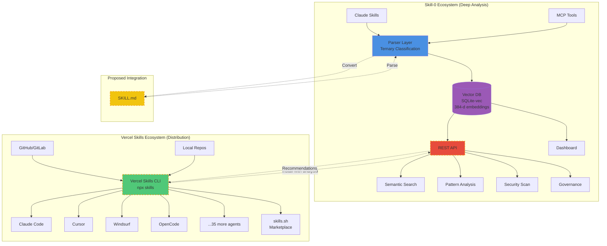

# Skill-0 vs Vercel Skills Architecture Diagram



## Key Differences

| Aspect | Skill-0 | Vercel Skills |
|--------|---------|---------------|
| **Focus** | Internal Structure Analysis | External Distribution |
| **Format** | Structured JSON (Schema 2.2.0) | Markdown + YAML |
| **Search** | Semantic (Vector) | Keyword (Text) |
| **Agents** | Claude, MCP | 39+ Coding Agents |
| **Governance** | ✅ Full | ❌ None |
| **Installation** | N/A | ✅ One-line CLI |

## Complementary Nature

```
User Creates Skill (SKILL.md)
        ↓
   Vercel Skills (Distribute to 39+ agents)
        ↓
   Agents Execute Skill
        ↓
   Skill-0 (Analyze & Recommend)
        ↓
   Enhanced Skill Discovery & Composition
```

## Integration Vision

### Phase 1: Format Bridge
- Implement `SKILL.md ↔ Skill-0 JSON` converter
- Enable Skill-0 to ingest Vercel ecosystem skills

### Phase 2: Analysis API
- Provide REST endpoint for security scanning
- Vercel CLI calls Skill-0 before installation
- Return: complexity score, security alerts, recommendations

### Phase 3: Marketplace Integration
- Skill-0 powers semantic search for skills.sh
- Intelligent recommendations based on vector similarity
- Pattern-based skill composition suggestions

---

*Diagram shows the complementary architecture where Skill-0 provides depth (parsing, analysis, governance) while Vercel Skills provides breadth (distribution across 39+ agents)*
